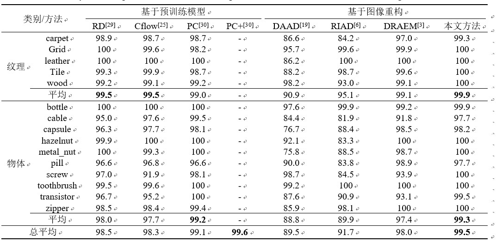
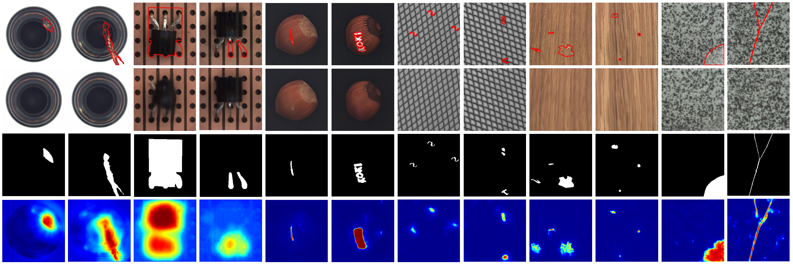
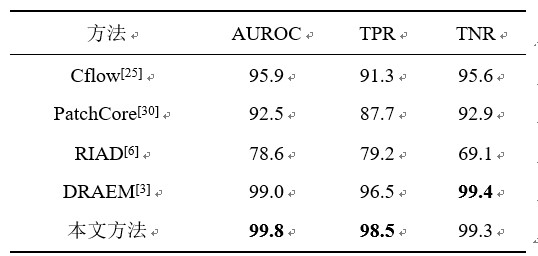
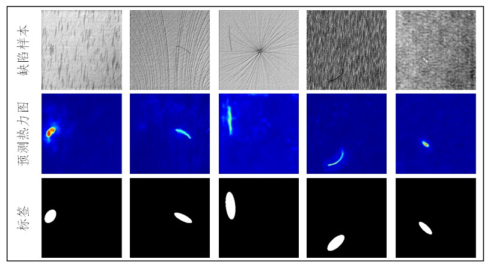

《计算机科学》期刊论文《基于图像重构与语义差异识别的表面异常检测》

+ 方法流程
  
  

+ MVTec实验结果

+ MVTec检测效果
  
  

+ DAGM实验结果
  
  

+ DAGM检测效果   

+ 主要文件

main.py    训练和测试代码

/model/model.py    模型

/model/decoder.py  重构网络的编码器结构和解码器结构

/model/memory.py   重构网络中的记忆模块的结构，MemoryUnit_prototype类是DPU（加入了位置编码），BlockMemory类是mul-lcDPU（没有最后的1x1卷积，1x1卷积在/model/decoder.py的Decoder类中）

/model/segnet.py   识别网络的结构（识别网络使用了Unet作为网络结构，输入为原始图和重构图的拼接）

/model/segnet_ours.py  多尺度深度特征融合的识别网络结构，输入图为原始图和重构图（这种网络结构的效果不稳定，现在的model.py里面使用的是segnet.py里面的识别网络结构）

/loader/mvtec_dataset.py  包含了MVTec数据集的训练集和测试集的加载

+ 训练示例命令

`CUDA_VISIBLE_DEVICES=3 python main.py --train --tag test1 --description '第一次实验，使用位置编码，使用segnet' --step 0 --epochs 100 --categroy bottle --positive_aug_ratio 2 --negative_aug_ratio 2 --validation_period 5 --batchsize 8 --mblock_size '8,16' --pic_size 256`

解释：CUDA_VISIBLE_DEVICES, 使用几号显卡，使用nvidia-smi查看显卡，显卡序号从0开始

--tag 给这次训练起的名字（之前每次训练都是不同的网络结构，方便区分）

--description 描述这次训练的话（随便写，可加可不加）

--step  从哪一个轮次开始训练

--epochs 训练多少个轮次

--category MVTec中哪一个类别，可以1个或多个，例如  bottle 或者 bottle,carpet,cable

--positive_aug_ratio 用来控制训练集中缺陷样本的数量（假如可利用的正常训练集数量是10，positive_aug_ratio是2，那么生成的模拟缺陷样本数量是10*2=20）

--negative_aug_ratio 用来控制训练集中正常样本的数量（假如可利用的正常训练集数量是10，negative_aug_ratio是2，那么训练集最终正常样本数量是10*2=20，其中后10个是数据增强得到的，旋转，放缩，平移等等）

--validation_period 每过多少个周期测试以此当前模型

--mblock_size 多尺度lcDPU接收的特征编码的尺寸（加入输入尺寸为8,3,256,256  那么编码器输出的尺寸是8,1024,16,16  如果--mblock_size 16  那多尺度lcDPU中只有一个lcDPU,输入是原尺寸；如果--mblock_size '8,16'  那么多尺度lcDPU中有两个lcDPU,输入分别是原尺寸和下采样到8,1024,8,8的尺寸；还可以尝试--mblock_size '4,8,16'）

--pic_size 输入图片的宽高，输入图片会被放缩到pic_size,pic_size的尺寸，如果pic_size变了，那编码器的输出尺寸也会变

+ 测试示例命令

`CUDA_VISIBLE_DEVICES=3 python main.py --test --tag test1 --description '第一次实验，使用位置编码，使用segnet' --step 100 --categroy bottle --batchsize 8 --mblock_size '8,16' --pic_size 256`

解释：--step 使用哪一个epoch的模型进行训练（现在的代码，只会保存最后一个epoch的模型参数，所以step应该填最后一个epoch，或者填-1，会直接调用最后一个epoch的模型参数）

--cpt_path 模型参数的路径（现在的代码，还会保存训练过程中指标最好的模型参数，保存名字是best_detect_auc.cpt, best_seg_auc.cpt，可以直接--cpt_path ./checkpoints/[tag]/[category]/best_detect_auc.cpt来测试指定的模型参数）
